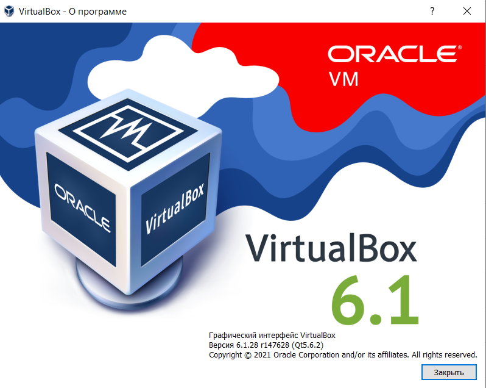

# Домашнее задание к занятию "5.2. Применение принципов IaaC в работе с виртуальными машинами"

## Как сдавать задания

Обязательными к выполнению являются задачи без указания звездочки. Их выполнение необходимо для получения зачета и диплома о профессиональной переподготовке.

Задачи со звездочкой (*) являются дополнительными задачами и/или задачами повышенной сложности. Они не являются обязательными к выполнению, но помогут вам глубже понять тему.

Домашнее задание выполните в файле readme.md в github репозитории. В личном кабинете отправьте на проверку ссылку на .md-файл в вашем репозитории.

Любые вопросы по решению задач задавайте в чате учебной группы.

---

## Задача 1

- Опишите своими словами основные преимущества применения на практике IaaC паттернов.
- Какой из принципов IaaC является основополагающим?
---
* Более быстрая и эффективная разработка.
* Ускорение производства и вывода продукта на рынок
* Стабильность среды, устранение дрейфа конфигураций

Идемпотентность ( повторный идентичный запрос, сделанный один или несколько раз подряд, имеет один и тот же эффект)
## Задача 2

- Чем Ansible выгодно отличается от других систем управление конфигурациями?
- Какой, на ваш взгляд, метод работы систем конфигурации более надёжный push или pull?
---
* простота входа
* На управляемые машины не устанавливается дополнительное ПО, соответственно, не инсталлируются уязвимые программы, а безопасность использования решения повышается.
* Портал Ansible Galaxy (Это объединение Ansible сообщества, где люди делятся наработками и решениями той или иной задачи.)
 
Выберу  pull, т.к более надежный, потому что доставка необходимых ресурсов ложится на клиента

## Задача 3

Установить на личный компьютер:

- VirtualBox

- Vagrant

- Ansible

*Приложить вывод команд установленных версий каждой из программ, оформленный в markdown.*

## Задача 4 (*)

Воспроизвести практическую часть лекции самостоятельно.

- Создать виртуальную машину.
- Зайти внутрь ВМ, убедиться, что Docker установлен с помощью команды
```
docker ps
```
