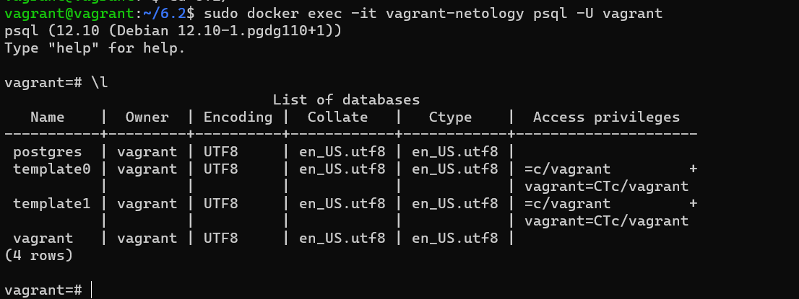
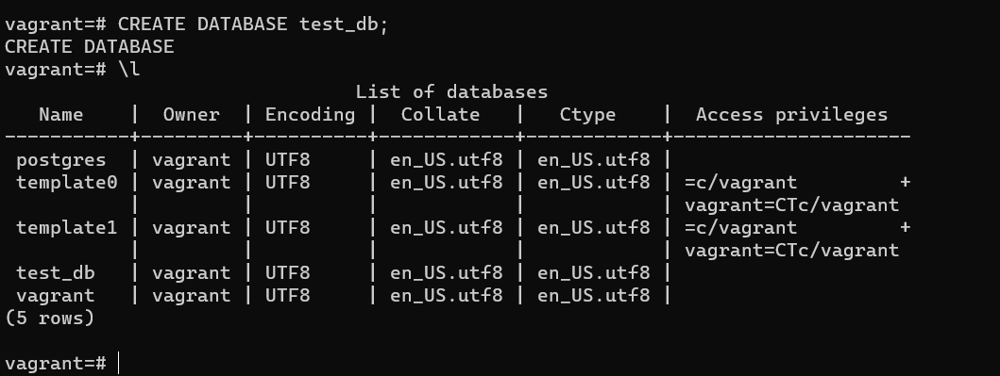
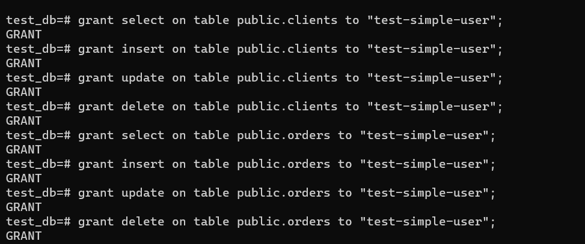
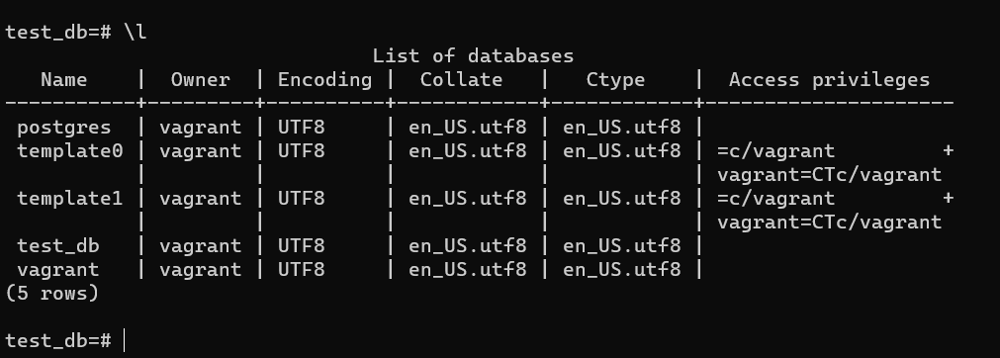
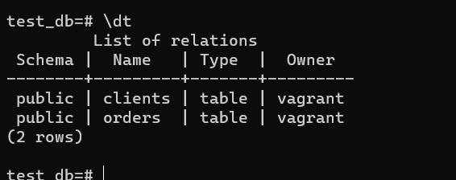
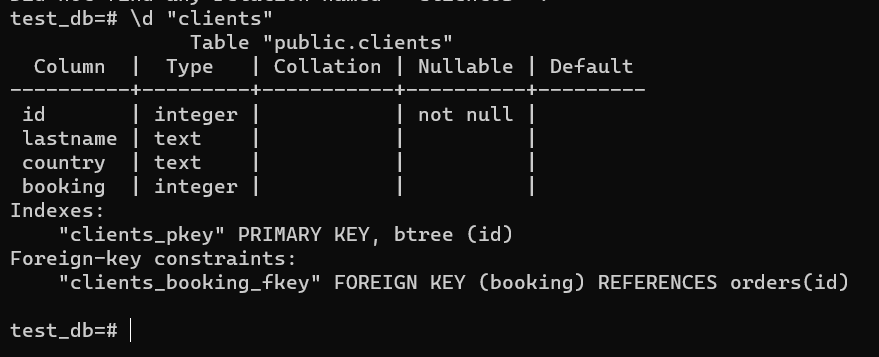
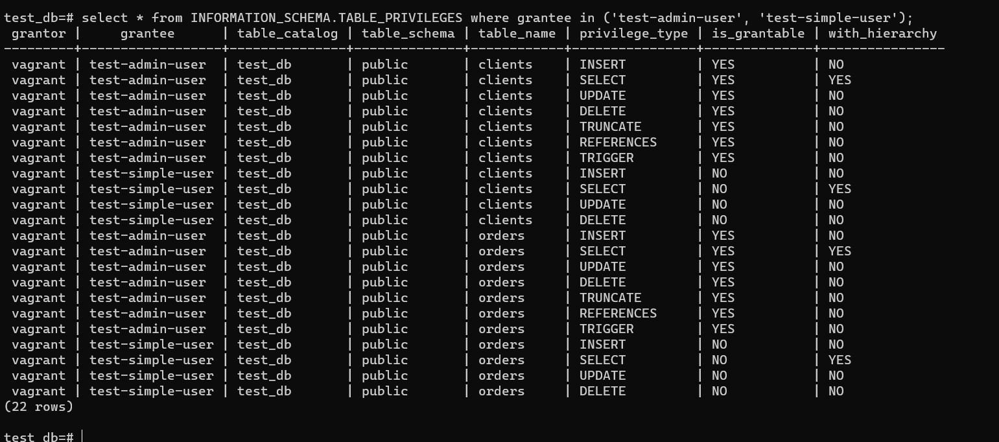
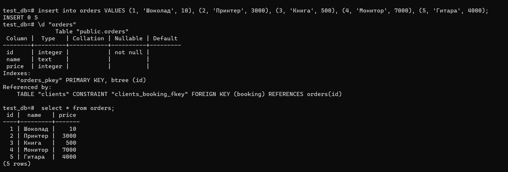
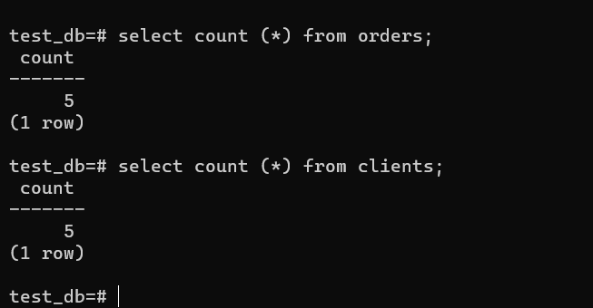
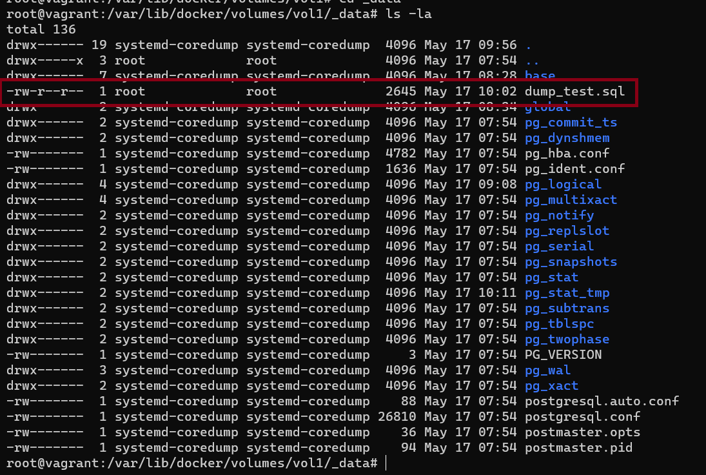

# Домашнее задание к занятию "6.2. SQL"

## Введение

Перед выполнением задания вы можете ознакомиться с 
[дополнительными материалами](https://github.com/netology-code/virt-homeworks/tree/master/additional/README.md).

## Задача 1

Используя docker поднимите инстанс PostgreSQL (версию 12) c 2 volume, 
в который будут складываться данные БД и бэкапы.

Приведите получившуюся команду или docker-compose манифест.
---

docker pull postgres:12

docker volume create vol1

docker volume create vol2

sudo docker run --rm --name vagrant-netology -e POSTGRES_PASSWORD=vagrant -e POSTGRES_USER=vagrant -e POSTGRES_DB=vagrant -d -ti -p 2222:2222 -v vol1:/var/lib/postgresql/data -v vol2:/var/lib/postgresql postgres:12

root@7c2aa13a3dcc:/#  psql -U postgres


## Задача 2

В БД из задачи 1: 
- создайте пользователя test-admin-user и БД test_db
Создаем БД test_db:

пользователя test-admin-user:


- в БД test_db создайте таблицу orders и clients (спeцификация таблиц ниже)


- предоставьте привилегии на все операции пользователю test-admin-user на таблицы БД test_db

- создайте пользователя test-simple-user 

- предоставьте пользователю test-simple-user права на SELECT/INSERT/UPDATE/DELETE данных таблиц БД test_db

Таблица orders:
- id (serial primary key)
- наименование (string)
- цена (integer)

Таблица clients:
- id (serial primary key)
- фамилия (string)
- страна проживания (string, index)
- заказ (foreign key orders)

Приведите:
- итоговый список БД после выполнения пунктов выше,

- описание таблиц (describe)



- SQL-запрос для выдачи списка пользователей с правами над таблицами test_db

- список пользователей с правами над таблицами test_db


## Задача 3

Используя SQL синтаксис - наполните таблицы следующими тестовыми данными:

Таблица orders

|Наименование|цена|
|------------|----|
|Шоколад| 10 |
|Принтер| 3000 |
|Книга| 500 |
|Монитор| 7000|
|Гитара| 4000|

Таблица clients

|ФИО|Страна проживания|
|------------|----|
|Иванов Иван Иванович| USA |
|Петров Петр Петрович| Canada |
|Иоганн Себастьян Бах| Japan |
|Ронни Джеймс Дио| Russia|
|Ritchie Blackmore| Russia|

Используя SQL синтаксис:
- вычислите количество записей для каждой таблицы 
- приведите в ответе:
    - запросы 
    - результаты их выполнения.

    - 
## Задача 4

Часть пользователей из таблицы clients решили оформить заказы из таблицы orders.

Используя foreign keys свяжите записи из таблиц, согласно таблице:

|ФИО|Заказ|
|------------|----|
|Иванов Иван Иванович| Книга |
|Петров Петр Петрович| Монитор |
|Иоганн Себастьян Бах| Гитара |

Приведите SQL-запросы для выполнения данных операций.

Приведите SQL-запрос для выдачи всех пользователей, которые совершили заказ, а также вывод данного запроса.
 
Подсказк - используйте директиву `UPDATE`.

## Задача 5

Получите полную информацию по выполнению запроса выдачи всех пользователей из задачи 4 
(используя директиву EXPLAIN).

Приведите получившийся результат и объясните что значат полученные значения.


cost - затратность операции

0.00 — затраты на получение первой строки.

18.10 — затраты на получение всех строк.

rows — приблизительное количество возвращаемых строк при выполнении операции Seq Scan. 

width — средний размер одной строки в байтах.
## Задача 6

Создайте бэкап БД test_db и поместите его в volume, предназначенный для бэкапов (см. Задачу 1).

vagrant@vagrant:~$ sudo docker exec -i vagrant-netology pg_dump -U vagrant test_db -f /var/lib/postgresql/data/dump_test.sql


Остановите контейнер с PostgreSQL (но не удаляйте volumes).


Поднимите новый пустой контейнер с PostgreSQL.

 sudo docker run --rm --name vagrant-netology-2 -e POSTGRES_PASSWORD=vagrant -e POSTGRES_USER=vagrant -e POSTGRES_DB=vagrant -d -ti -p 5432:5432 -v vol1:/var/lib/postgresql/data -v vol2:/var/lib/postgresql postgres:12


Восстановите БД test_db в новом контейнере.
При создании нового окнтейнера волюмы подключились атвоматически

 
```html
vagrant@vagrant:~/6.2$ docker exec -it vagrant-netology-2 bash 
root@e6fbc855b9a2:/# 
root@e6fbc855b9a2:/# psql -U postgres
psql (12.9 (Debian 12.9-1.pgdg110+1))
Type "help" for help.


postgres=# \l
                                 List of databases
   Name    |  Owner   | Encoding |  Collate   |   Ctype    |   Access privileges   
-----------+----------+----------+------------+------------+-----------------------
 postgres  | postgres | UTF8     | en_US.utf8 | en_US.utf8 | 
 template0 | postgres | UTF8     | en_US.utf8 | en_US.utf8 | =c/postgres          +
           |          |          |            |            | postgres=CTc/postgres
 template1 | postgres | UTF8     | en_US.utf8 | en_US.utf8 | =c/postgres          +
           |          |          |            |            | postgres=CTc/postgres
 test1     | postgres | UTF8     | en_US.utf8 | en_US.utf8 | 
 test_db   | postgres | UTF8     | en_US.utf8 | en_US.utf8 | 
(6 rows)

```

```html
vagrant=# \dt
Did not find any relations.
vagrant=# \c test_db
You are now connected to database "test_db" as user "vagrant".
test_db=# \dt
         List of relations
 Schema |  Name   | Type  |  Owner
--------+---------+-------+---------
 public | clients | table | vagrant
 public | orders  | table | vagrant
(2 rows)

test_db=# select * from clients;
 id |       lastname       | country | booking
----+----------------------+---------+---------
  4 | Ронни Джеймс Дио     | Russia  |
  5 | Ritchie Blackmore    | Russia  |
  1 | Иванов Иван Иванович | USA     |       3
  2 | Петров Петр Петрович | Canada  |       4
  3 | Иоганн Себастьян Бах | Japan   |       5
(5 rows)

test_db=# select * from orders;
 id |  name   | price
----+---------+-------
  1 | Шоколад |    10
  2 | Принтер |  3000
  3 | Книга   |   500
  4 | Монитор |  7000
  5 | Гитара  |  4000
(5 rows)
```


Приведите список операций, который вы применяли для бэкапа данных и восстановления. 

```html
vagrant=# drop database test_db;
DROP DATABASE
vagrant=# create database test_db;
CREATE DATABASE
vagrant=# \q
root@247f0bc6f0b3:/# psql -U vagrant -d test_db -f /var/lib/postgresql/data/dump_test.sql;
SET
SET
SET
SET
SET
 set_config
------------

(1 row)

SET
SET
SET
SET
SET
SET
CREATE TABLE
ALTER TABLE
CREATE TABLE
ALTER TABLE
COPY 5
COPY 5
ALTER TABLE
ALTER TABLE
ALTER TABLE
GRANT
GRANT
root@247f0bc6f0b3:/#  psql -U vagrant
psql (12.10 (Debian 12.10-1.pgdg110+1))
Type "help" for help.

vagrant=# \l
                               List of databases
   Name    |  Owner  | Encoding |  Collate   |   Ctype    |  Access privileges
-----------+---------+----------+------------+------------+---------------------
 postgres  | vagrant | UTF8     | en_US.utf8 | en_US.utf8 |
 template0 | vagrant | UTF8     | en_US.utf8 | en_US.utf8 | =c/vagrant         +
           |         |          |            |            | vagrant=CTc/vagrant
 template1 | vagrant | UTF8     | en_US.utf8 | en_US.utf8 | =c/vagrant         +
           |         |          |            |            | vagrant=CTc/vagrant
 test_db   | vagrant | UTF8     | en_US.utf8 | en_US.utf8 |
 vagrant   | vagrant | UTF8     | en_US.utf8 | en_US.utf8 |
(5 rows)
```
---

### Как cдавать задание

Выполненное домашнее задание пришлите ссылкой на .md-файл в вашем репозитории.

---
