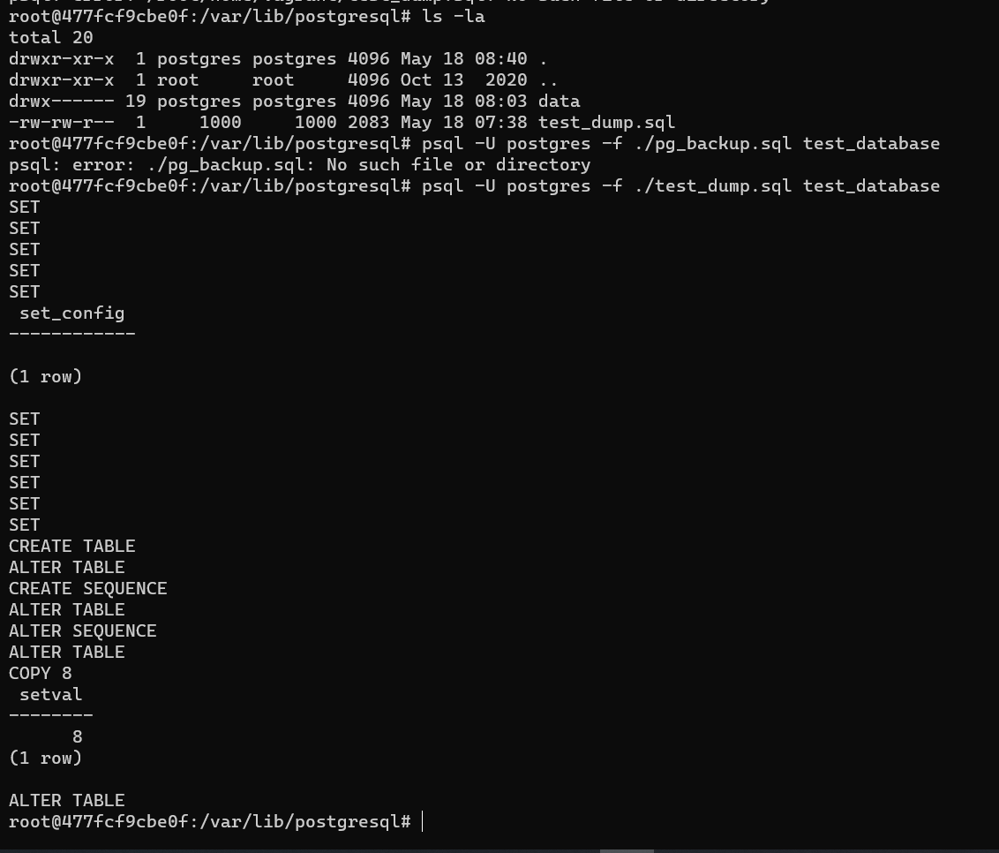
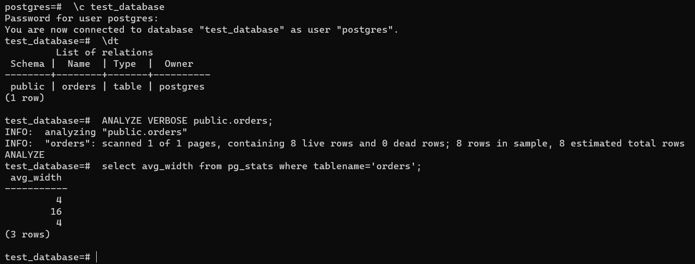

# Домашнее задание к занятию "6.4. PostgreSQL"

## Задача 1

Используя docker поднимите инстанс PostgreSQL (версию 13). Данные БД сохраните в volume.

Подключитесь к БД PostgreSQL используя `psql`.

Воспользуйтесь командой `\?` для вывода подсказки по имеющимся в `psql` управляющим командам.

**Найдите и приведите** управляющие команды для:
- вывода списка БД
- подключения к БД
- вывода списка таблиц
- вывода описания содержимого таблиц
- выхода из psql

---
```html
sudo docker pull postgres:13
sudo docker volume create vol_postgres
sudo docker run --rm --name pg-docker -e POSTGRES_PASSWORD=postgres -ti -p 5432:5432 -v vol_postgres:/var/lib/postgresql/data postgres:13
sudo docker exec -it pg-docker bash
root@477fcf9cbe0f:/# psql -h localhost -p 5432 -U postgres -W
```
* вывода списка БД


* подключения к БД


* вывода списка таблиц

 вывода списка таблиц postgres-# \dt - в таблицах пусто

\dtS : параметр S - для системных объектов


вывод описания содержимого таблиц

postgres-# \d[S+] NAME
  
postgres-# \dS+ pg_am


* выход из psql
postgres-# \q


## Задача 2

Используя `psql` создайте БД `test_database`.

Изучите [бэкап БД](https://github.com/netology-code/virt-homeworks/tree/master/06-db-04-postgresql/test_data).

Восстановите бэкап БД в `test_database`.

Перейдите в управляющую консоль `psql` внутри контейнера.

Подключитесь к восстановленной БД и проведите операцию ANALYZE для сбора статистики по таблице.

Используя таблицу [pg_stats](https://postgrespro.ru/docs/postgresql/12/view-pg-stats), найдите столбец таблицы `orders` 
с наибольшим средним значением размера элементов в байтах.
---





**Приведите в ответе** команду, которую вы использовали для вычисления и полученный результат.

## Задача 3

Архитектор и администратор БД выяснили, что ваша таблица orders разрослась до невиданных размеров и
поиск по ней занимает долгое время. Вам, как успешному выпускнику курсов DevOps в нетологии предложили
провести разбиение таблицы на 2 (шардировать на orders_1 - price>499 и orders_2 - price<=499).

Предложите SQL-транзакцию для проведения данной операции.

Можно ли было изначально исключить "ручное" разбиение при проектировании таблицы orders?
---

```html
test_database=# alter table orders rename to orders_simple;
ALTER TABLE
test_database=# сreate table orders (id integer, title varchar(80), price integer) partition by range(price);
ERROR:  syntax error at or near "сreate"
test_database=#  create table orders (id integer, title varchar(80), price integer) partition by range(price);
CREATE TABLE
test_database=#  create table orders_less499 partition of orders for values from (0) to (499);
CREATE TABLE
test_database=#  create table orders_more499 partition of orders for values from (499) to (999999999);
CREATE TABLE
test_database=#  insert into orders (id, title, price) select * from orders_simple;
INSERT 0 8
test_database=#
```
Ручное разбиение можно было исключить,если бы сразу при проектировании таблицу сделали бы селекционной, тогда не пришлось бы переименовывать исходную таблицу и переносить данные в новую.
## Задача 4

Используя утилиту `pg_dump` создайте бекап БД `test_database`.

```html
root@477fcf9cbe0f:/var/lib/postgresql#  pg_dump -U postgres -d test_database >test_database_dump.sql
```


Как бы вы доработали бэкап-файл, чтобы добавить уникальность значения столбца `title` для таблиц `test_database`?

Для уникальности можно добавить индекс или первичный ключ.
CREATE INDEX ON orders ((lower(title)));
---

### Как cдавать задание

Выполненное домашнее задание пришлите ссылкой на .md-файл в вашем репозитории.

---
